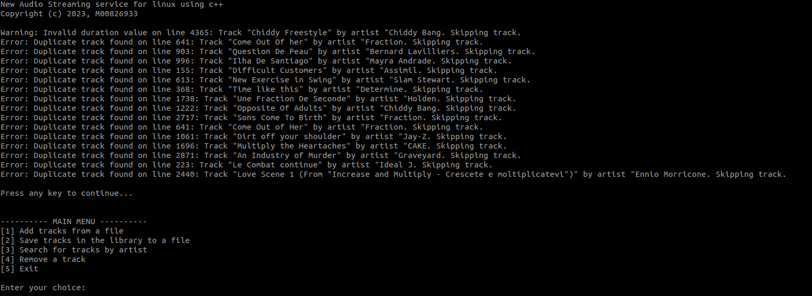

# Audio Streaming Service for Linux

This project is a simple audio streaming service implemented in `C++` for `Linux`. It allows users to manage and stream music tracks using a `hash table` data structure.



## Features

- Load tracks from a file and store them in a hash table.
- Save tracks from the library to a file.
- Search for tracks by artist's name.
- Remove a track from the library.
- Case-insensitive string comparison for searching and removing tracks.
- Resize the hash table dynamically to handle more tracks efficiently.

## Getting Started

### Prerequisites

- C++ compiler (g++)
- CMake (for building Catch2 tests)
- Catch2 (for unit testing)

### Compilation

1. Clone the repository to your local machine:

   ```bash
   git clone https://github.com/derecklhw/audio_streaming_system_data_structure.git
   ```

2. Compile the executable and test program using the provided Makefile:

   ```bash
   make all
   ```

   This will generate two executables: `music_library` for the main program and `testing` for running tests.

### Usage

1. Run the main program:

   ```bash
   ./music_library <file_name>
   ```

   Replace `<filename>` with the name of the file containing music tracks. The program will load the tracks from the file and present a main menu for different operations.

2. Main Menu Options:

- [1] Add tracks from a file: Add new tracks from a different file to the library.
- [2] Save tracks in the library to a file: Save the current tracks in the library to a new file.
- [3] Search for tracks by artist: Search for tracks by entering the artist's name.
- [4] Remove a track: Remove a specific track by entering its title and artist.
- [5] Exit: Exit the program.

### Testing

The project includes tests using Catch2. To run the tests, use the following command:

```bash
./testing
```
